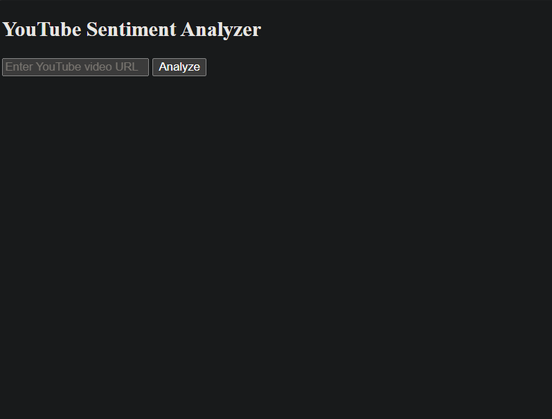

# 🎬 YouTube Sentiment Analyzer 🔍

Analyze the sentiment of comments on any YouTube video using AI-powered models — and visualize the results with charts and word clouds.


---

## 📸 Demo Preview

> Coming Soon: Add a screenshot of your deployed app here



---

## 🚀 Live App

👉 [Click here to try the app]([https://your-app-name.onrender.com](https://youtube-video-sentiment.onrender.com/))

---

## 💡 Features

- ✅ Scrapes comments using **YouTube Data API v3**
- ✅ Performs sentiment analysis using **VADER**
- ✅ Generates:
  - 📊 Pie chart of sentiments
  - ☁️ Word cloud of comment terms
- ✅ Simple, clean Flask frontend
- ✅ Fully deployable to Render (free hosting)

---

## 🛠️ Tech Stack

| Layer       | Tech Used                     |
|-------------|-------------------------------|
| Frontend    | HTML, Jinja2 (via Flask)       |
| Backend     | Python, Flask                  |
| NLP Model   | VADER SentimentIntensityAnalyzer |
| Charts      | Matplotlib, WordCloud         |
| Hosting     | Render.com                    |
| Data Source | YouTube Data API v3           |

---

## 🔧 Local Setup

### 1. Clone the repo

```bash
git clone https://github.com/geekybread/Youtube_sentiment_analysis.git
cd Youtube_sentiment_analysis
